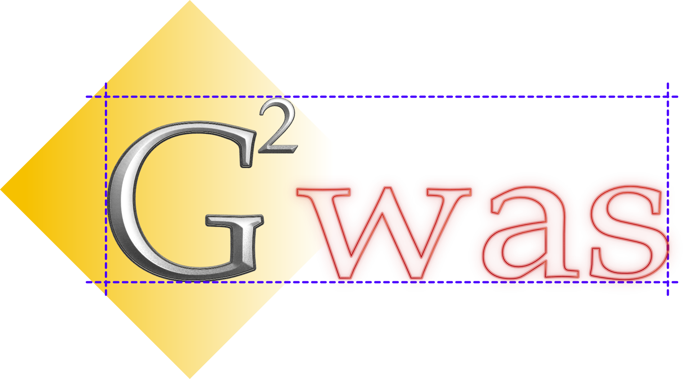
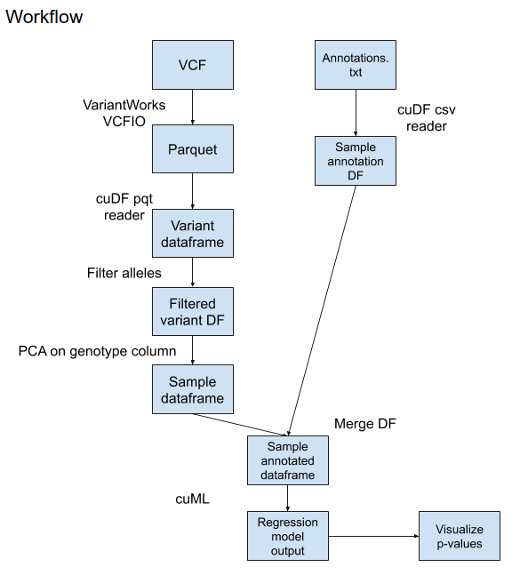

# G2WAS (GPU-GWAS)



## Background, description and goals
TODO: Fill in background on GWAS

G2WAS aims to develop a fast GWAS data analysis pipeline incorporating GPU acceleration and Machine learning.

[rapids.ai](https://rapids.ai/) will be the core SDK that powers this high performance compute. RAPIDS provides GPU-accelerated
implementations of dataframe and machine learning algorithms which are tens to hundreds of times faster than CPU implementations.

Our high level goals for the hackathon include - 
* Recreating the Hail GWAS sample using RAPIDS APIs
* Wrapping RAPIDS GWAS functions into high level APIs within gpu-gwas framework
* (if time permits) Scaling to larger VCF dataset (e.g. chr22)

Working doc for our team is [here](https://docs.google.com/document/d/1d_czQ9OE_XqtRw2X67fqCzUvQRriuvWXqTSNLmTAzVE/edit#heading=h.xvl7m2ful8yu)

## Workflow


## System requirements
To get the best experience running this framework (or developing it!), we recommend having
access to a machine with the following build - 

0. Ubuntu 18.04+
1. NVIDIA GPU (Pascal architecture onwards)
2. NVIDIA CUDA Toolkit 10.1+ [Instructions here](https://developer.nvidia.com/CUDA-TOOLKIT-ARCHIVE)

## Setup
The primary dependency of this project is installing the RAPIDS frameworks.
RAPIDS has very clear [instructions](https://rapids.ai/start.html#get-rapids) for how to download and install it, based on the CUDA Toolkit, python version and operating system being used.

Our experiments were based on the following setup
```
# Make sure CUDA Toolkit 10.2 is installed
conda create -n rapids-0.16 -c rapidsai -c nvidia -c conda-forge \
    -c defaults rapids=0.16 python=3.7 cudatoolkit=10.1
```

Once the conda environment is setup, additional python dependencies for `gpugwas` are installed from `pip`.
```
conda activate rapids-0.16
python3 -m pip install -r requirements.txt
```

To make sure your environment was setup properly, please run the following command from the repo root.
```
python workflow.py
```

## Package components
The `gpugwas` package is broken up into multiple independent modules that deal with different components
of the GWAS pipeline. The modules are all located under the `gpugwas` folder.

1. `gpugwas.io` - This module contains I/O related functions such as loading a VCF/annotation file into a CUDA dataframe.
2. `gpugwas.algorithms` - This module contains ML algorithm implementations in CUDA typically used in GWAS (e.g. linear regression, logistic regression, etc).
3. `gpugwas.viz` - This module contains functions used in visualizing the GWAS model outputs (manhattan plots, q-q plots, etc)
4. `gpugwas.filters` - This module containts functions to filter out variants and samples and perform QC on the input data.

## Example Use Case
Using the package components described above we have built a sample workflow that runs a toy GWAS example.
The contents of this script follow the workflow outlined above.

We use the VCF and annotations dataset from the [Hail GWAS example](https://hail.is/docs/0.2/tutorials/01-genome-wide-association-study.html)
for our experiment. Please download them to your system first before proceeding with the sample.

Our workflow showcasing the relevant APIs and processing steps is detailed in [jupyter notebook](workflow.ipynb).

To run it on your system, please execute
```
jupyter notebook workflow.ipynb
```

## Next Steps
